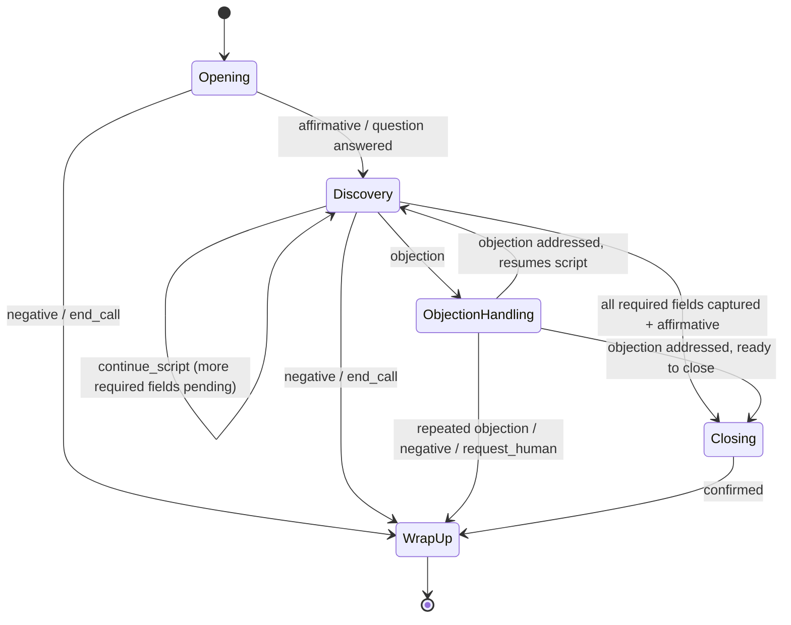

# AI Calling Agent — Conversation Flow

Complete outbound calling workflow, with disconnect recovery · v1.0 · Status: Production Ready

**Related documents:** AI Agent Specification v1.0 · Prompt Specification v1.0 · Call State Machine v1.0 · Detailed Workflow v1.0

**Purpose:** the AI Agent Specification defines the agent's behavior rules and the Prompt Specification defines how those rules become a model call. This document defines the actual **conversation design** — the phases a call moves through, sample dialogue for each, and how intents (Prompt Specification §4) route the conversation between phases. It is the content a conversation designer configures as the campaign's script skeleton (AI Agent Specification §2).

---

## 1. Conversation phases

| Phase | Purpose | Typically maps to `next_action` |
|---|---|---|
| **1. Opening** | Introduce the agent and the reason for the call; earn permission to continue | `continue_script` |
| **2. Discovery** | Ask the script's qualifying questions; capture required entity fields | `continue_script`, `answer_question` |
| **3. Objection handling** | Respond to hesitation or pushback without abandoning the goal | `handle_objection` |
| **4. Closing** | Confirm outcome and next step once the goal is reached or the contact is ready | `confirm_and_close` |
| **5. Wrap-up** | End the call cleanly, whatever the outcome | `end_call_polite`, `end_call_goal_met` |

**`request_human` in any phase:** per AI Agent Specification §8, the agent first sets `next_action = escalate_to_human_offer` to acknowledge the request and offer a callback or alternative contact method, then proceeds to Wrap-up as `end_call_polite`. This applies from Opening, Discovery, Objection Handling, and Closing alike (see §3.1–§3.4 and the routing table in §4).

A call does not always move through phases 1→5 in strict order — objection handling can be re-entered from Discovery or Closing, and the call can exit to Wrap-up from any phase.

---

## 2. Phase flow diagram

**Reconnect re-entry:** per the AI Agent Specification (§9), a reconnected call re-enters whichever phase `script_progress` indicates it was in when the disconnect occurred — it does not restart at Opening.

---

## 3. Phase-by-phase design

### 3.1 Opening
**Goal:** identify the agent, state the purpose briefly, and get an initial signal to continue.

Sample flow (illustrative, campaign-configurable):
> "Hi, this is [agent] calling on behalf of [brand] — do you have a quick minute?"

- `affirmative` / `question` → proceed to Discovery.
- `negative` → move directly to Wrap-up with a polite close; do not attempt Discovery.
- `request_human` → acknowledge, `next_action = escalate_to_human_offer` (offer escalation contact method), proceed to Wrap-up.

### 3.2 Discovery
**Goal:** work through the script skeleton's talking points, capturing required entity fields (AI Agent Specification §4) as they come up naturally — not as a rigid interrogation.

Sample flow:
> "Can I ask what you're currently using for [relevant topic]?"
> "And who else would typically be involved in a decision like this?"

- Each answer is checked against `required_entity_fields`; `script_progress` updates as fields are captured.
- `objection` at any point → branch to Objection Handling.
- All required fields captured + `affirmative` sentiment → proceed to Closing.
- `negative` / `end_call` → proceed to Wrap-up.

### 3.3 Objection handling
**Goal:** acknowledge the concern, respond to it briefly, and offer a path back into the conversation — without pretending the objection wasn't raised.

Sample flow:
> Contact: "I don't really have time for this right now."
> Agent: "Totally understand — would a quick two-minute version work, or should I catch you at a better time?"

- Objection addressed and contact re-engages → return to Discovery (if fields remain) or Closing (if fields are already captured).
- A second/repeated objection, or `negative` after handling → proceed to Wrap-up rather than persisting further (AI Agent Specification §8).
- `request_human` during objection handling → acknowledge, `next_action = escalate_to_human_offer`, proceed to Wrap-up.

### 3.4 Closing
**Goal:** confirm the outcome and, if applicable, the next step (e.g. a follow-up call, a resource being sent).

Sample flow:
> "Great — I'll get [next step] sent over. Does [proposed follow-up time] work for you?"

- Confirmation received → proceed to Wrap-up as `end_call_goal_met`.

### 3.5 Wrap-up
**Goal:** end the call cleanly regardless of outcome, and set the correct disposition.

Sample flow (positive):
> "Perfect, thanks so much for your time — you'll hear from us [timeframe]. Have a great day!"

Sample flow (decline):
> "No problem at all, thanks for your time — take care!"

- Every Wrap-up sets a disposition matching the outcome (goal met / declined / objection unresolved / escalated) for the Call Summary output field.
- If `requires_suppression = true` was set at any point, Wrap-up must include acknowledgment of the do-not-call request before ending.

---

## 4. Intent-to-phase routing summary

| Intent (Prompt Specification §4) | Opening | Discovery | Objection Handling | Closing |
|---|---|---|---|---|
| `affirmative` | → Discovery | → Discovery / Closing | → Discovery / Closing | → Wrap-up |
| `negative` | → Wrap-up | → Wrap-up | → Wrap-up (if repeated) | — |
| `question` | → Discovery (after answering) | stays in Discovery | stays in Objection Handling | stays in Closing |
| `objection` | — | → Objection Handling | stays, re-attempt | → Objection Handling |
| `request_callback` | → Wrap-up (schedule) | → Wrap-up (schedule) | → Wrap-up (schedule) | → Wrap-up (schedule) |
| `request_human` | → Wrap-up (`escalate_to_human_offer` then `end_call_polite`) | → Wrap-up (`escalate_to_human_offer` then `end_call_polite`) | → Wrap-up (`escalate_to_human_offer` then `end_call_polite`) | → Wrap-up (`escalate_to_human_offer` then `end_call_polite`) |
| `off_topic` | brief redirect, stays | brief redirect, stays | brief redirect, stays | brief redirect, stays |
| `end_call` | → Wrap-up | → Wrap-up | → Wrap-up | → Wrap-up |
| `unclear` | one clarification attempt, then Wrap-up if still unclear | same | same | same |

---

## 5. Disconnect mid-phase

If a disconnect occurs in any phase, Stage 4 recovery (Detailed Workflow) takes over. On a successful reconnect, the opening line (Prompt Specification §5) briefly acknowledges the disconnect and then resumes **within the same phase** the call was in — Objection Handling resumes as Objection Handling, not as a fresh Opening.

---

## 6. Design notes for campaign configuration

- Keep Opening short — a long introduction increases early `negative`/`end_call` responses.
- Discovery questions should be ordered so that the highest-value required fields (e.g. interest level) are captured early, in case the call disconnects or ends before all fields are covered.
- Objection Handling responses should be specific to the campaign's likely objections, not generic — configure a short list of anticipated objections and a response pattern for each, rather than relying entirely on the model's own judgment.
- Closing should always restate the next step explicitly — an ambiguous close leads to a low-confidence disposition.

---

*No lost conversations. More opportunities. Higher conversion.*
