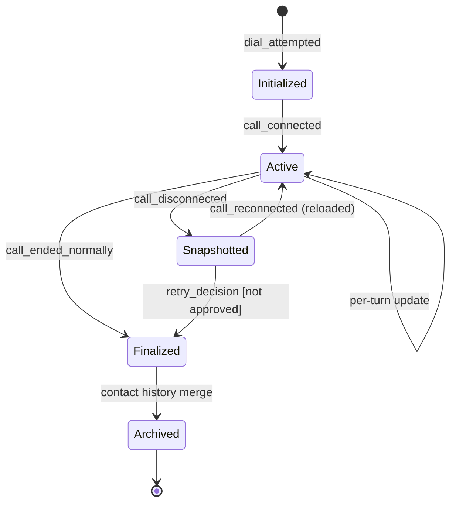

# AI Calling Agent — Memory Specification

Complete outbound calling workflow, with disconnect recovery · v1.0 · Status: Production Ready

**Related documents:** AI Agent Specification v1.0 · Prompt Specification v1.0 · Call State Machine v1.0 · System Architecture v1.0 · Infrastructure Architecture v1.0

**Purpose:** memory is referenced across several documents — as a schema (AI Agent Specification §6), as prompt context (Prompt Specification §2), as a durability requirement (Infrastructure Architecture §4), and as what gets saved and reloaded around a disconnect (Call State Machine §4). This document is the single source of truth for what memory actually contains, how it moves through its lifecycle, and what guarantees it must meet.

---

## 1. Memory types

The system uses two distinct layers of memory. They are easy to conflate but serve different purposes and have different lifetimes.

| Type | Scope | Lifetime | Used for |
|---|---|---|---|
| **Working memory** | One call attempt | Created at dial, ends when the attempt reaches a terminal state | Turn-by-turn context within a single conversation, including across a disconnect/reconnect |
| **Contact history** | One contact, across all attempts | Persists for the life of the contact in the campaign | Cross-attempt continuity (e.g. "second call to this contact"), post-call analysis, Final Output's contact view |

This document focuses primarily on **working memory**, since that is what is saved on disconnect and reloaded on reconnect (`FR-4.1`, `FR-4.5`). Contact history is addressed in §7.

---

## 2. Working memory schema

Expands AI Agent Specification §6 with types and constraints.

| Field | Type | Description |
|---|---|---|
| `attempt_id` | string | Unique identifier for the current call attempt |
| `contact_id` | string | Links back to the contact record |
| `turns` | array of `{utterance, intent, entities, response_text, timestamp}` | Ordered log of the conversation so far |
| `captured_entities` | object | Current values for all entity fields defined in AI Agent Specification §4; unset fields are `not_captured` |
| `script_progress` | object `{phase, completed_points: [], pending_points: []}` | Current conversation phase (per Conversation Flow) and which script points are done vs. outstanding |
| `objections_raised` | array of `{objection, addressed: bool}` | Every objection encountered and whether it was resolved |
| `last_agent_utterance` | string | The agent's most recent spoken line — used to construct the reconnect opening (Prompt Specification §5) |
| `disconnect_count` | integer | How many times this attempt has been interrupted and resumed |
| `requires_suppression` | boolean | Set true if a do-not-call request was captured; must survive into contact history even after this attempt ends |
| `recording_consent` | enum `{granted, denied, unclear, not_applicable}` | Captured once per attempt per Recording-Consent.md §2–§3; set from the structured output's top-level `recording_consent` field (Prompt Specification §4), not from `captured_entities`. Persisted verbatim to `call_attempt.recording_consent` (Database Design §2.5) at Finalized. |
| `schema_version` | string | Version of this schema in effect when the record was written (see §8) |

---

## 3. Memory lifecycle

**Stage descriptions:**

- **Initialized:** an empty working-memory record is created when a call attempt begins dialing, pre-populated with any relevant fields carried over from contact history (§7) for repeat attempts.
- **Active:** updated after every completed turn (§4).
- **Snapshotted:** on disconnect, the record is written to durable storage exactly as it stood at that moment — no partial or in-progress turn is included (`FR-4.1`).
- **Reloaded:** on a successful reconnect, the snapshotted record is read back and becomes the active memory for the new attempt, continuing the same `turns` log rather than starting a new one (`FR-4.5`, `FR-4.6`).
- **Finalized:** once the attempt reaches a terminal state (ended normally, or closed as partial with no further retry), the working memory is marked read-only.
- **Archived:** finalized working memory is merged into contact history (§7) for cross-attempt reference and then may be pruned from the fast-access working-memory store per retention rules (§9).

---

## 4. Update triggers

Working memory is updated at exactly these points, and nowhere else:

1. After each turn's structured output is produced (Prompt Specification §4) — appends to `turns`, merges `entities` into `captured_entities`, updates `script_progress`, `objections_raised`, and `recording_consent` (when the top-level field is present on that turn's output).
2. On disconnect — snapshot as-is (§3).
3. On reconnect — reload, then resume normal per-turn updates.
4. On call termination — final write, `schema_version` stamped, moved to Finalized.

No other process may write to a call attempt's working memory. Post-call analysis reads it but does not modify it.

---

## 5. Durability & consistency requirements

- The disconnect snapshot write (Step 2 above) must be **acknowledged as durable before** any retry decision is evaluated (Infrastructure Architecture §4, Call State Machine §4). This is the single most important guarantee in this specification — it is the mechanism behind "no lost conversations."
- A reconnect must read the **most recent** snapshot for the correct `attempt_id`; reading a stale or wrong-attempt snapshot would produce an incoherent resume.
- Per-turn updates during `Active` state should be written incrementally (not held only in process memory) so that a disconnect at any point — including mid-turn — has something to snapshot; an in-flight, not-yet-completed turn is not included in the snapshot (only completed turns per §4.1).

---

## 6. Read/write access matrix

| Component | Reads | Writes |
|---|---|---|
| Conversation Orchestrator | Working memory (for prompt context) | `turns`, `captured_entities`, `script_progress`, `objections_raised`, `last_agent_utterance`, `recording_consent` (per turn) |
| State Saver (Recovery Layer) | — | Snapshot on disconnect (verbatim copy, no transformation) |
| Reconnect Manager | Snapshot | Restores as Active working memory |
| Post-Call Analysis | Finalized working memory | Contact history (§7), not working memory itself |
| Admin Dashboard | Contact history / Final Output | — (no direct working-memory access) |

---

## 7. Contact history

A lighter-weight, longer-lived record per contact, built from finalized working memory records:

| Field | Description |
|---|---|
| `contact_id` | Identifier |
| `attempt_summaries` | One entry per attempt: outcome, disposition, key entities captured, timestamp |
| `cumulative_entities` | Best-known values for each entity field across all attempts (later attempts can update earlier values) |
| `suppression_flag` | Once `requires_suppression` is set on any attempt, this is permanently true for the contact, overriding future campaign eligibility |

Contact history feeds the Final Output's "Contact view (admin)" field (`FR-5.3`) and is what a repeat call's `Initialized` working memory is seeded from.

---

## 8. Schema versioning

- `schema_version` is stamped on every working memory record at write time.
- A change to the working memory schema (adding/removing/renaming a field) increments the version.
- Reload logic (Reconnect Manager) must handle reading a snapshot written under a previous schema version — either by migrating it on read or by explicitly supporting the previous version's shape for backward compatibility. A reconnect must never fail solely because the snapshot predates a schema change.

---

## 9. Retention & privacy

- Working memory contains conversational content and captured entities, which may include personal information — it is subject to the same encryption-at-rest and access-control requirements as recordings and transcripts (Infrastructure Architecture §7).
- `Finalized` working memory should be retained only as long as needed to support archival into contact history and any required audit window, then pruned from the fast-access store; the durable record of the call lives on in the transcript, recording, and contact history, not in the working-memory store indefinitely.
- `suppression_flag` in contact history must be retained independently of normal data-retention/expiry rules, since it represents an ongoing compliance obligation, not just historical data.

---

## 10. Context window management

Because `turns` grows with every exchange, the Prompt Specification's system prompt (§2, "CONVERSATION SO FAR") should inject a **summary** of older turns rather than the full verbatim log once a call exceeds a configured turn-count threshold, to stay within the language model's context limits without losing the substance of what's already been discussed. `captured_entities`, `script_progress`, and `objections_raised` are already-summarized state and should always be injected in full regardless of call length.

---

## 11. Traceability

| Memory element | Referenced in |
|---|---|
| Schema fields | AI Agent Specification §6, Prompt Specification §2/§5 |
| Snapshot-before-retry-decision ordering | Call State Machine §4, Infrastructure Architecture §4 |
| Reconnect reload | Detailed Workflow Step 4.5, Call State Machine §2/§3 |
| Contact view output | FRS FR-5.3 |
| Suppression propagation | AI Agent Specification §8 |
| `recording_consent` field | Prompt Specification §4, Database Design §2.5, Recording-Consent.md §4 |

---

*No lost conversations. More opportunities. Higher conversion.*
