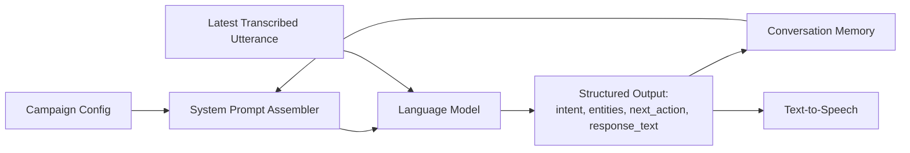

# AI Calling Agent — Prompt Specification

Complete outbound calling workflow, with disconnect recovery · v1.0 · Status: Production Ready

**Related documents:** PRD v1.0 · FRS v1.0 · System Architecture v1.0 · AI Agent Specification v1.0 · Call State Machine v1.0

**Purpose:** the AI Agent Specification defines *what* the agent must do (persona, intents, entities, guardrails). This document defines *how* that behavior is implemented as concrete prompts to the language model — the system prompt template, per-turn context injection, structured output schema, and the reconnect variant.

---

## 1. Prompt architecture overview

Each conversational turn sends the language model **one system prompt** (assembled from campaign configuration + accumulated memory) and **one user-turn message** (the latest transcribed utterance). The model returns a **structured output** (§4) rather than free text alone, so intent, entities, and the next action are all produced in a single call.



---

## 2. System prompt template

Placeholders (`{{ }}`) are filled from campaign configuration (AI Agent Specification §10) and live conversation memory (AI Agent Specification §6) on every turn.

```
You are an automated calling assistant representing {{campaign_brand_name}}.

PERSONA
- Tone: {{persona_tone}}                 e.g. "warm and casual" / "formal and concise"
- You must identify yourself as an automated assistant if asked whether you are human.
- Do not invent facts you have not been given below. If you don't know something,
  offer to have a human follow up instead of guessing.

GOAL
{{campaign_goal}}

SCRIPT SKELETON (talking points to cover, in a natural order — not a verbatim script)
{{script_skeleton_bulleted}}

REQUIRED FIELDS TO CAPTURE
{{required_entity_fields_bulleted}}

CONVERSATION SO FAR
{{captured_entities_summary}}
{{script_progress_summary}}
{{objections_raised_summary}}

GUARDRAILS
- If the contact asks to speak with a human, acknowledge this, offer:
  {{escalation_contact_method}}, and move toward a polite close.
- If the contact declines twice, do not persist — move toward a polite close.
- If the contact asks to be removed from future calls, confirm you will note this
  and end the call politely. Set requires_suppression = true in your output.
- If you cannot understand the contact after a couple of clarification attempts,
  end the call gracefully rather than looping.

OUTPUT FORMAT
Respond only with a single JSON object matching the schema provided separately.
Do not include any text outside the JSON object.
```

---

## 3. Per-turn user message template

```
LATEST CONTACT UTTERANCE (transcribed):
"{{transcribed_utterance}}"

Classify this utterance, extract any relevant entities, decide the next action,
and produce your spoken response, per the system instructions and output schema.
```

---

## 4. Structured output schema

The model must return exactly this shape (illustrated as JSON Schema):

```json
{
  "type": "object",
  "required": ["intent", "entities", "next_action", "response_text"],
  "properties": {
    "intent": {
      "type": "string",
      "enum": ["affirmative", "negative", "question", "objection",
               "request_callback", "request_human", "off_topic",
               "end_call", "unclear"]
    },
    "entities": {
      "type": "object",
      "properties": {
        "interest_level": { "type": "string", "enum": ["interested", "not_interested", "undecided", "not_captured"] },
        "objection": { "type": "string" },
        "follow_up_preference": { "type": "string" },
        "decision_maker_status": { "type": "string", "enum": ["sole", "influencer", "not_involved", "not_captured"] },
        "free_text_feedback": { "type": "string" }
      }
    },
    "next_action": {
      "type": "string",
      "enum": ["continue_script", "answer_question", "handle_objection",
               "confirm_and_close", "escalate_to_human_offer",
               "end_call_polite", "end_call_goal_met"]
    },
    "requires_suppression": { "type": "boolean" },
    "recording_consent": {
      "type": "string",
      "enum": ["granted", "denied", "unclear", "not_applicable"],
      "description": "Top-level field, not an entity under `entities`. Set when the turn addresses call-recording consent (see Recording-Consent.md §2-§3); otherwise omitted/defaults to not_applicable for that turn. Persisted to Memory Specification §2 `recording_consent` and, at Finalized, to Database Design §2.5 `call_attempt.recording_consent`."
    },
    "response_text": { "type": "string" }
  }
}
```

**Notes:**
- `entities` fields are only populated when actually present in the utterance; absent fields stay `not_captured` rather than being guessed (AI Agent Specification §4).
- `requires_suppression` defaults to `false` and is only set `true` on an explicit do-not-call request (AI Agent Specification §8); it propagates to the contact record, not just the current call.
- `recording_consent` is a top-level field (not nested under `entities`) since it is a compliance capture, not a lead-scoring entity; it defaults to `not_applicable` and is only set to `granted`/`denied`/`unclear` on the turn where consent is actually addressed (Recording-Consent.md §2-§3).
- `response_text` is the exact text to be spoken via TTS — it must not contain the JSON structure itself or any meta-commentary.

---

## 5. Reconnect prompt variant

Used only when resuming a call after Stage 4 recovery (AI Agent Specification §9). The system prompt is the same as §2, with one addition inserted directly after "CONVERSATION SO FAR":

```
RECONNECT CONTEXT
This call was disconnected unexpectedly and has just been reconnected.
Your last line before the disconnect was:
"{{last_agent_utterance}}"

Your first response in this turn must:
1. Briefly acknowledge the disconnect.
2. Reference where the conversation left off (use the line above and/or
   script progress) so the contact feels continuity, not a restart.
3. Invite them to continue, then proceed with the next appropriate action.
```

The user-turn message on reconnect is either the contact's first utterance after answering again, or, if they haven't spoken yet, a system-generated placeholder such as `"[call reconnected, contact has not yet spoken]"` so the model still produces an opening `response_text`.

---

## 6. Example turn (illustrative)

**Campaign context:** goal = qualify interest in a software product; script includes asking about current tooling and budget.

**Assembled system prompt (abridged):** persona = "warm and casual"; required fields = interest_level, decision_maker_status.

**User turn:**
```
LATEST CONTACT UTTERANCE (transcribed):
"I mean, maybe, but I'm not the one who signs off on this stuff."
```

**Expected structured output:**
```json
{
  "intent": "objection",
  "entities": {
    "interest_level": "undecided",
    "decision_maker_status": "not_involved"
  },
  "next_action": "handle_objection",
  "requires_suppression": false,
  "recording_consent": "not_applicable",
  "response_text": "Totally understand — would it help if I sent over a quick summary you could pass along to whoever does make that call?"
}
```

---

## 7. Model parameters

| Parameter | Guidance |
|---|---|
| Temperature | Low-to-moderate — favor consistency and script adherence over creative variation, since output feeds a structured schema |
| Max response length | Bounded to keep `response_text` conversational (a few sentences), not a monologue |
| Structured output enforcement | The model call should use the provider's structured/function-output mode where available, rather than relying on prompted JSON alone, to guarantee schema conformance |
| Retry-on-malformed-output | If the model returns output that fails schema validation, the turn should be retried once with a corrective note before falling back to a safe default (`next_action = end_call_polite`) |

---

## 8. Prompt versioning

- The system prompt template (§2) is versioned independently of the application code, since campaign managers or admins may need to update script skeletons and personas without a deployment (consistent with System Architecture's "configuration without deployment" principle).
- Each conversation memory record should log which prompt template version was in effect, so post-call analysis and debugging can account for behavioral differences across versions.

---

## 9. Traceability

| Prompt element | AI Agent Specification reference |
|---|---|
| Persona block | §1 |
| Goal / script skeleton / required fields | §2, §10 |
| Guardrails block | §8 |
| Structured output — intent | §5 |
| Structured output — entities | §4 |
| Structured output — `recording_consent` | Recording-Consent.md §2-§3 (not an AI Agent Specification §4 entity — see §4 of this document) |
| Reconnect variant | §9 |

---

*No lost conversations. More opportunities. Higher conversion.*
