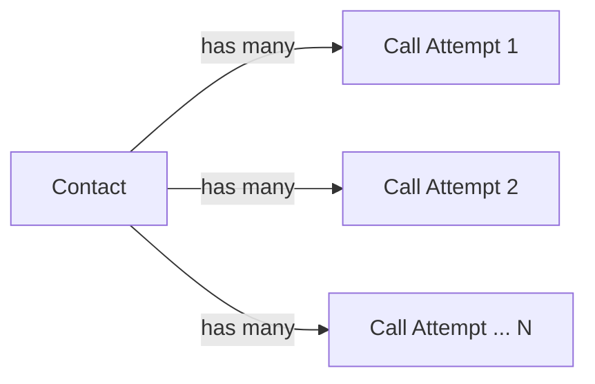
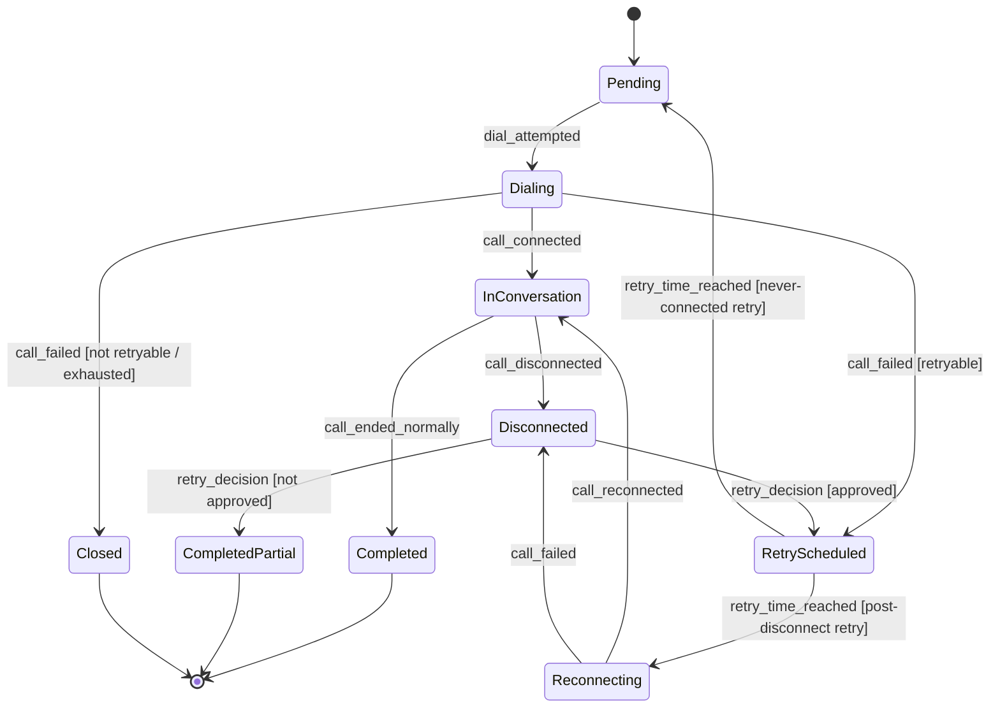
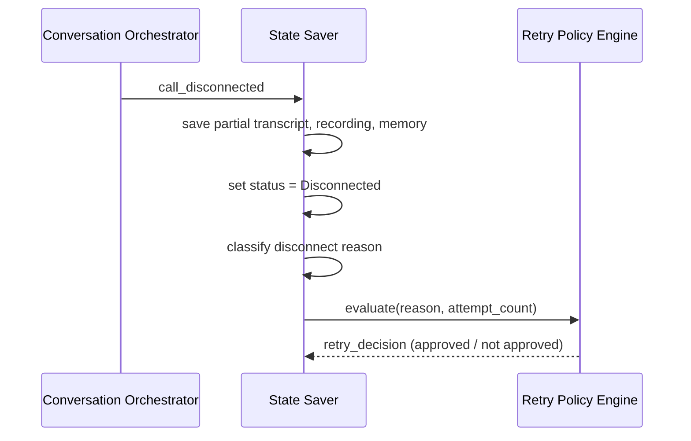

# AI Calling Agent — Call State Machine

Complete outbound calling workflow, with disconnect recovery · v1.0 · Status: Production Ready

**Related documents:** PRD v1.0 · FRS v1.0 · User Stories v1.0 · Acceptance Criteria v1.0 · System Architecture v1.0 · Detailed Workflow v1.0

**Purpose:** define the formal states a contact and a call attempt can be in, the events that move them between states, and the guards that decide which transition fires. This is the authoritative reference for implementation and for test-case design against `FR-x.y`.

---

## 1. Two state machines, one contact

A **Contact** persists across its whole lifetime in a campaign. Each time it is dialed, it produces a **Call Attempt** — a shorter-lived state machine nested inside the contact's lifecycle. A contact can have multiple call attempts; only the current attempt is active at any time.

---

## 2. Contact state machine

### 2.1 States

| State | Meaning |
|---|---|
| `Pending` | Imported, validated, waiting in the calling queue. Initial state. `[FR-1.4]` |
| `Dialing` | A call attempt is currently being placed. |
| `InConversation` | A call attempt is connected and the conversation loop is active. |
| `Disconnected` | The active attempt dropped unexpectedly; state has been saved and is awaiting a retry decision. `[FR-4.2]` |
| `RetryScheduled` | A retry (never-connected or post-disconnect) has been approved and queued for a future time. `[FR-1.8, FR-4.4]` |
| `Reconnecting` | A scheduled post-disconnect retry is being dialed. |
| `Completed` | The contact reached a normal end of conversation and has a Final Output record. Terminal. `[FR-3.1]` |
| `CompletedPartial` | The contact was closed out after a disconnect with no further retry, and has a Final Output record. Terminal. `[FR-4.8]` |
| `Closed` | The contact never connected and retries are exhausted or disallowed. No Final Output record is produced. Terminal. `[FR-1.8]` |

### 2.2 Transition table

| From | Event | Guard | To |
|---|---|---|---|
| `Pending` | `dial_attempted` | — | `Dialing` |
| `Dialing` | `call_connected` | — | `InConversation` |
| `Dialing` | `call_failed` | reason retryable AND attempts < max_retries | `RetryScheduled` |
| `Dialing` | `call_failed` | reason ∈ {`rejected`, `invalid_number`} OR attempts ≥ max_retries | `Closed` |
| `RetryScheduled` | `retry_time_reached` | — | `Pending` |
| `InConversation` | `call_ended_normally` | — | `Completed` |
| `InConversation` | `call_disconnected` | — | `Disconnected` |
| `Disconnected` | `state_saved` | — | *(internal — see §4, does not change Contact state)* |
| `Disconnected` | `retry_decision` | approved | `RetryScheduled` |
| `Disconnected` | `retry_decision` | not approved | `CompletedPartial` |
| `RetryScheduled` *(post-disconnect)* | `retry_time_reached` | — | `Reconnecting` |
| `Reconnecting` | `call_reconnected` | — | `InConversation` *(memory reloaded, loop resumes)* |
| `Reconnecting` | `call_failed` | — | *(re-evaluated as a new disconnect event, back to* `Disconnected` *guard logic)* |

> **Note on `RetryScheduled` reuse:** the same state name is used for both a never-connected retry (returns to `Pending`, redialed as a fresh attempt) and a post-disconnect retry (moves to `Reconnecting`, redialed with reloaded memory). Implementations should tag which kind of retry is scheduled so the correct next transition fires — these are not interchangeable despite sharing a state name.

### 2.3 Terminal states

Three states end a contact's lifecycle: `Completed`, `CompletedPartial`, `Closed`. Only the first two produce a Final Output record (`FR-5.1`, `FR-5.2`) — `Closed` reflects a contact that never had a conversation.

### 2.4 Diagram

---

## 3. Call attempt state machine

Nested inside each pass through `Dialing` → (`InConversation` | `Disconnected`) → attempt-terminal. Tracks the specific attempt's own record.

### 3.1 States

| State | Meaning |
|---|---|
| `Initiated` | Attempt created, dial in progress. |
| `Connected` | Attempt successfully connected; conversation loop active. |
| `FailedToConnect` | Attempt did not connect; carries a failure reason. Terminal for this attempt. |
| `DroppedMidCall` | Attempt was connected and then disconnected; carries a disconnect reason. Terminal for this attempt. |
| `EndedNormally` | Attempt's conversation completed without disconnecting. Terminal for this attempt. |

### 3.2 Transition table

| From | Event | To |
|---|---|---|
| `Initiated` | `call_connected` | `Connected` |
| `Initiated` | `call_failed` | `FailedToConnect` |
| `Connected` | `call_ended_normally` | `EndedNormally` |
| `Connected` | `call_disconnected` | `DroppedMidCall` |

A new attempt (a fresh `Initiated` state) is created whenever the Contact re-enters `Dialing` — whether from `Pending` (never-connected retry) or from `Reconnecting` (post-disconnect retry). A reconnect is **not** a continuation of the same attempt record; it is a new attempt that inherits the previous attempt's conversation memory.

---

## 4. Sub-flow: the disconnect save (not a Contact-level state)

Step 4.1 of the Detailed Workflow (save transcript, recording, memory; set status `Disconnected`) happens as an atomic action, not as a separate waiting state:

**Guard invariant:** `retry_decision` may only be evaluated after the save completes. This ordering is a correctness requirement (see System Architecture §6, "State durability") — a retry or close-out decision must never be made against an unsaved call.

---

## 5. Guards reference

This system uses **two distinct, non-overlapping reason taxonomies**. They must never be mixed: a never-connected call attempt is classified using `NEVER_CONNECTED_FAILURE_REASON`; an attempt that connected and then dropped is classified using `MID_CALL_DISCONNECT_REASON`. `technical_issue` is a `MID_CALL_DISCONNECT_REASON` value only — it is not a valid value of `NEVER_CONNECTED_FAILURE_REASON` and must not appear in never-connected retry logic.

### 5.1 `NEVER_CONNECTED_FAILURE_REASON` (Dialing → call_failed)

| Reason | Retryable by default | Rationale |
|---|---|---|
| `no_answer` | Yes | Transient — the contact may answer on a later attempt |
| `busy` | Yes | Transient — the line was in use, likely to clear |
| `invalid_number` | No | Permanent — the number itself is bad; retrying cannot succeed |
| `rejected` | No | The contact actively declined the call |
| `network_error` | Yes | Transient — carrier/network-side issue on our end |
| `provider_error` | Yes | Transient — telephony provider-side issue |

Canonical enum and retry defaults match Database Design §2.5 (`retry_policy.never_connected_rules`) and API Specification `RetryPolicyInput.never_connected_rules` exactly.

### 5.2 `MID_CALL_DISCONNECT_REASON` (InConversation → call_disconnected)

| Reason | Retryable by default | Rationale |
|---|---|---|
| `technical_issue` | Yes | Transient — retry likely to succeed |
| `network_problem` | Yes | Transient |
| `provider_error` | Yes | Transient — telephony provider-side issue |
| `ai_error` | Yes | Transient — model/pipeline fault, not a contact signal |
| `unknown` | Yes | Conservative default — retry rather than assume the worst |
| `customer_hangup` | No | The contact ended the call themselves; evaluated through the same policy engine as every other reason (no hardcoded bypass), but the default rule is not to retry |

Canonical enum and retry defaults match Database Design §2.5 (`retry_policy.mid_call_rules`) and API Specification `RetryPolicyInput.mid_call_rules` exactly.

### 5.3 Other guards

| Guard | Definition | Used in |
|---|---|---|
| `reason retryable` | The reason's default in §5.1 (never-connected) or §5.2 (mid-call), as overridden by the active `retry_policy` configuration | `Dialing → RetryScheduled`, `Disconnected → retry_decision` |
| `attempts < max_retries` | Current attempt count is below the configured maximum (default `max_retries = 2`, i.e. up to 2 retries beyond the initial attempt — 3 total dial attempts) | Both retry evaluations |
| `within calling window` | Current time falls inside the configured window (default 10 AM – 6 PM); if not, the transition is deferred, not blocked | `RetryScheduled → Pending`, `RetryScheduled → Reconnecting` |

---

## 6. Illegal transitions (explicitly excluded)

These are called out because they represent the two mistakes previously found and corrected in the workflow diagram review:

- **`Dialing (never-connected retry) → InConversation` bypassing `Pending`.** A never-connected retry must re-enter the queue as `Pending`; it must not jump straight back into dialing state without going through the queue, and it must never target the contact-import step.
- **`FailedToConnect → CompletedPartial`.** `CompletedPartial` is reserved for calls that reached `Connected` and then disconnected. A call that never connected has no conversation to partially complete, and must resolve to `Closed` instead.

---

## 7. Traceability

| State machine element | FRS reference |
|---|---|
| `Pending`, `Dialing`, `Closed`, retry-to-queue guard | FR-1.4, FR-1.6–FR-1.9 |
| `InConversation`, conversation loop | FR-2.1–FR-2.7 |
| `Disconnected`, state save, reason classification | FR-2.8, FR-4.1–FR-4.3 |
| `RetryScheduled`, `Reconnecting`, resume-with-memory | FR-4.4–FR-4.7, FR-6.1–FR-6.6 |
| `CompletedPartial` | FR-4.8–FR-4.10 |
| `Completed`, `CompletedPartial` → Final Output | FR-5.1–FR-5.3 |

---

*No lost conversations. More opportunities. Higher conversion.*
