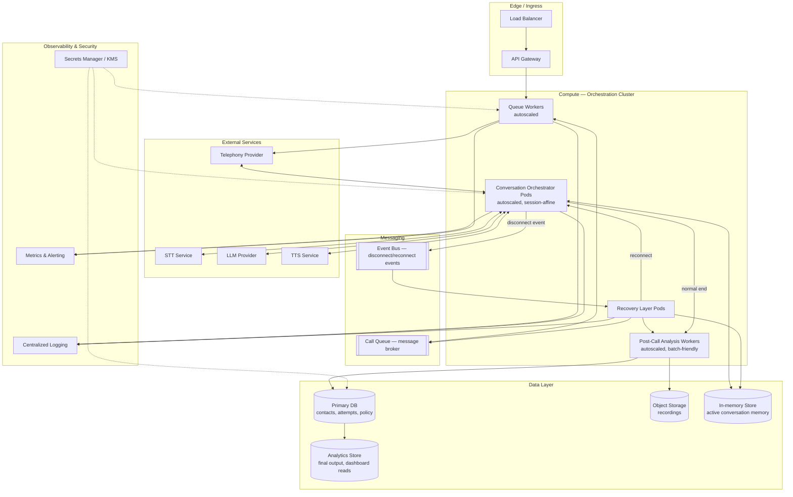

# AI Calling Agent — Infrastructure Architecture

Complete outbound calling workflow, with disconnect recovery · v1.0 · Status: Production Ready

**Related documents:** PRD v1.0 · FRS v1.0 · System Architecture v1.0 · Call State Machine v1.0 · Detailed Workflow v1.0

**Purpose:** where the System Architecture document describes logical components and data flow, this document describes how those components are actually deployed, scaled, secured, and operated — the physical/infrastructure view.

---

## 1. Infrastructure topology

---

## 2. Compute layer

| Service | Role | Scaling model |
|---|---|---|
| Queue Workers | Pull contacts from the Call Queue, respect call rate & window, initiate dials via the telephony provider | Horizontally autoscaled on queue depth; stateless |
| Conversation Orchestrator | Runs the per-call STT → LLM → TTS loop for one active call each | Autoscaled on concurrent-call count; each pod holds one call's session state for the call's duration (session-affine) |
| Recovery Layer | Handles disconnect detection, state save, retry evaluation, reconnect dispatch | Event-driven, autoscaled on event-bus backlog; stateless between events |
| Post-Call Analysis Workers | Run transcript analysis (interest, lead score, feedback) | Autoscaled batch/worker pool; can tolerate queueing delay unlike the live-call path |

**Session affinity note:** because the Conversation Orchestrator holds live audio/session state, a pod is bound to a call for its duration. A reconnect after a disconnect is treated as a **new** orchestrator session that loads memory from the cache/data layer — it does not require routing back to the same pod that handled the dropped call.

---

## 3. Messaging

- **Call Queue (message broker):** durable queue holding contacts awaiting a dial attempt, including scheduled never-connected and post-disconnect retries. Must support delayed/scheduled delivery to implement retry spacing (30 sec / 10 min, per the default 2-retry policy — Database Design §2.2) without a worker polling loop.
- **Event Bus:** carries disconnect and reconnect-approved events from the Orchestrator/Recovery Layer to whichever service needs to react, decoupling the orchestrator from directly calling the recovery layer's internals.

---

## 4. Data layer

| Store | Holds | Notes |
|---|---|---|
| Primary DB | Contacts, campaigns, call attempts, retry policy config | Relational; source of truth for state-machine states (see Call State Machine doc) |
| Object Storage | Call recordings | Written once per attempt; referenced by ID from the Primary DB, not stored inline |
| In-memory Store | Active conversation memory for calls currently in progress or scheduled for reconnect | Low-latency read/write; must survive the process restart of an individual orchestrator pod, since a disconnect must not lose memory (`FR-4.1`) |
| Analytics Store | Final output records, dashboard read-model | Denormalized for fast dashboard queries; updated asynchronously from the Primary DB |

**Durability requirement:** the write to the In-memory Store (or its durable backing) in the disconnect save step must complete and be acknowledged **before** the Recovery Layer evaluates a retry decision — this is the infrastructure-level enforcement of the ordering invariant defined in the Call State Machine document (§4).

---

## 5. External service integration

| Service | Latency sensitivity | Notes |
|---|---|---|
| Telephony provider | High | Connection/disconnect events must reach the platform in near real time to trigger recovery promptly |
| STT | High | On the critical path of every conversational turn |
| LLM provider | High | On the critical path of every conversational turn; response time directly affects perceived naturalness |
| TTS | High | On the critical path of every conversational turn |

**Placement implication:** the Conversation Orchestrator, STT, LLM, and TTS should be deployed in the same region (or as close as network topology allows) to keep round-trip latency within the conversational turn budget. The Queue Workers and Post-Call Analysis Workers are not latency-critical and can run in any region with data-layer proximity.

---

## 6. Scaling considerations

- **Contact volume (100,000+ per campaign):** the Call Queue and Queue Workers must scale independently of the Conversation Orchestrator — most queued contacts are waiting, not talking, so queue throughput and live-conversation concurrency are different scaling dimensions.
- **Concurrent live calls:** Orchestrator pod count scales with concurrent connected calls, not with total campaign size.
- **Retry bursts:** because retries use escalating delayed delivery, the queue must handle bursts of contacts becoming eligible at the same scheduled time (e.g. many 30-second retries landing together) without starving fresh dials.
- **Post-call analysis backlog:** analysis is not on the live-call critical path and can queue during peak call volume without affecting conversation quality.

---

## 7. Security

- **PII handling:** contact phone numbers, recordings, and transcripts are personally identifiable and must be encrypted at rest (Object Storage, Primary DB) and in transit (all service-to-service calls).
- **Secrets:** telephony, STT, LLM, and TTS provider credentials are held in a secrets manager / KMS, not in application config or source control.
- **Access control:** the Admin Dashboard's write access to retry policy configuration (`FR-3.6`) should be role-restricted, separate from read-only campaign-status access.
- **Retention:** recordings and transcripts should have a defined retention period aligned with applicable telephony/data-privacy regulations; expiry should be enforced at the Object Storage / Primary DB layer, not left to manual cleanup.

---

## 8. Observability

- **Centralized logging:** every stage transition (per the Call State Machine) should be logged with contact ID, attempt ID, and timestamp, enabling reconstruction of a contact's full journey for support and debugging.
- **Metrics:** connection rate, disconnect rate, reconnect success rate, retry exhaustion rate, and per-turn conversation latency should be tracked as first-class metrics, since they map directly to the PRD's success metrics.
- **Alerting:** sustained increases in disconnect rate or reconnect failure rate should alert operations — these directly threaten the "no lost conversations" guarantee.

---

## 9. Environments & deployment

| Environment | Purpose |
|---|---|
| Development | Feature work; external services mocked or sandboxed |
| Staging | Pre-production validation against sandboxed telephony/STT/LLM/TTS providers, full state-machine and retry-policy testing |
| Production | Live campaigns |

- Deployments to the Conversation Orchestrator should avoid dropping in-progress calls; a rolling deployment strategy should drain existing sessions before terminating old pods, since an infrastructure-triggered disconnect must be handled by the same recovery flow as any other disconnect reason.
- Retry policy and calling-window configuration changes (`FR-6.7`) take effect immediately and do not require a deployment, per the System Architecture document.

---

## 10. Disaster recovery

- **In-memory Store failure:** if the active conversation memory store becomes unavailable mid-call, the resulting disconnect must be classified and handled through the standard Stage 4 recovery flow — infrastructure failures are not a special case exempt from the save-and-classify guarantee.
- **Regional failover:** the Primary DB and Object Storage should be replicated with a defined recovery point objective; the Call Queue should be durable enough that in-flight and scheduled retries are not lost during a failover.
- **Provider outage (telephony/STT/LLM/TTS):** an external provider outage should surface as a high `provider_error` rate — as a `disconnect_reason` for calls that had connected, or as a `connection_failure_reason` for calls that never connected (`technical_issue` applies only to the former, never the latter — see Call State Machine §5.1–§5.2) — and be handled by the existing retry policy rather than requiring bespoke outage logic.

---

*No lost conversations. More opportunities. Higher conversion.*
