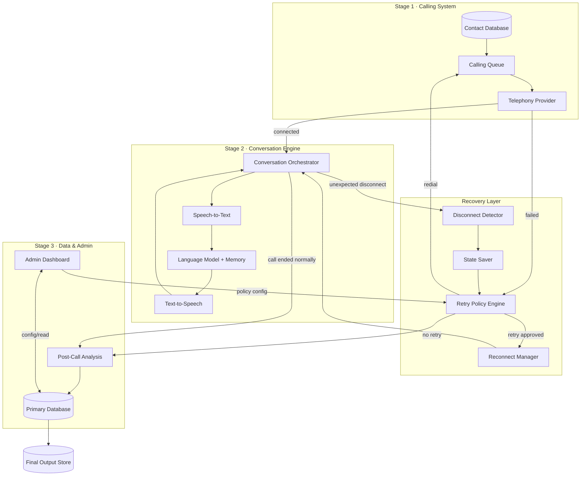

# AI Calling Agent — System Architecture

Complete outbound calling workflow, with disconnect recovery · v1.0 · Status: Production Ready

**Related documents:** PRD v1.0 · FRS v1.0 · User Stories v1.0 · Acceptance Criteria v1.0 · Workflow diagram v1.0

---

## 1. Purpose

This document describes how the AI Calling Agent is put together — its components, how they communicate, and how data flows through a call from import to final output. It gives engineering a shared technical picture to implement against the FRS's functional requirements (`FR-x.y`).

---

## 2. Architecture at a glance

**Reading this diagram:** solid arrows are the main call path; the recovery layer sits alongside the conversation engine rather than after it — it can hand control back into the conversation orchestrator (reconnect) or forward into post-call analysis (partial close-out), matching the workflow diagram's two outcomes for a disconnected call.

---

## 3. Components

### 3.1 Contact Database
- Stores raw imported contacts, campaign metadata, and per-contact status (`Pending`, `Dialing`, `Completed`, `Completed (Partial)`, `Disconnected`).
- Owns deduplication and validation logic on import (`FR-1.1`–`FR-1.4`).

### 3.2 Calling Queue
- Schedules dial attempts against the configured call rate and calling window (`FR-1.5`, `FR-6.6`).
- Receives contacts back from the Retry Policy Engine for redial (`FR-1.8`, `FR-1.9`) — this is the only re-entry point for a failed or exhausted call; it never routes back to the Contact Database.

### 3.3 Telephony Provider (external)
- Places the outbound call and reports connection status and disconnect events.
- Failure reasons it can report: `no answer`, `busy`, `invalid number`, `rejected`, `network error`, `provider error` (`FR-1.7`).

### 3.4 Conversation Orchestrator
- Runs the listen → understand → respond loop (`FR-2.7`) by coordinating STT, the language model, and TTS.
- Holds the in-call conversation memory used for context (`FR-2.3`) and for reconnection (`FR-4.5`).
- Detects caller interruptions and manages turn-taking (`FR-2.6`).
- On an unexpected disconnect signal from the telephony layer, hands off to the Disconnect Detector rather than proceeding to post-call analysis directly (`FR-2.8`).

### 3.5 Speech-to-Text (STT)
- Transcribes caller audio to text in real time and detects end-of-utterance silence (`FR-2.1`, `FR-2.2`).

### 3.6 Language Model + Memory
- Interprets intent and entities against accumulated conversation memory, and decides the next action against the configured script and campaign goals (`FR-2.3`, `FR-2.4`).

### 3.7 Text-to-Speech (TTS)
- Renders the decided response as natural-sounding speech (`FR-2.5`).

### 3.8 Disconnect Detector
- Watches for an unexpected drop while the orchestrator's loop is active and triggers the recovery path (`FR-2.8`).

### 3.9 State Saver
- Immediately persists the partial transcript, recording captured so far, and conversation memory, and sets call status to `Disconnected` (`FR-4.1`, `FR-4.2`).
- Also classifies the disconnect reason (`FR-4.3`): `technical issue`, `network problem`, `provider error`, `customer hangup`, `AI error`, `unknown`.

### 3.10 Retry Policy Engine
- Single shared component consumed by both the Calling Queue (never-connected failures) and the recovery layer (mid-call disconnects) (`FR-6.1`–`FR-6.7`).
- Holds configurable rules: max retries, retry spacing, per-reason retry eligibility, calling window.
- Produces a binary retry / no-retry decision per evaluation (`FR-1.8`, `FR-4.4`).

### 3.11 Reconnect Manager
- On a retry-approved decision from a disconnect, redials the contact, reloads saved conversation memory, and re-enters the Conversation Orchestrator's loop from the last context (`FR-4.5`–`FR-4.7`).

### 3.12 Post-Call Analysis
- Runs against the full or partial transcript to produce interest classification, lead score, and feedback extraction (`FR-3.1`, `FR-3.2`, `FR-4.9`).
- Runs from two entry points: a normally ended call (Stage 3 path) and a call closed out as `Completed (Partial)` (Stage 4 path) — both converge here.

### 3.13 Primary Database
- Stores recordings, transcripts, analysis output, and contact/attempt history (`FR-3.3`, `FR-3.4`).

### 3.14 Admin Dashboard
- Reads live campaign status, lead classification, and analytics from the Primary Database (`FR-3.5`).
- Writes retry-policy configuration to the Retry Policy Engine (`FR-3.6`, `FR-6.7`) — this is a configuration link, not a call-processing path.

### 3.15 Final Output Store
- Holds one consolidated record per contact per terminal call: transcript, recording, feedback, interest detection, lead score, call summary, and the admin contact view (`FR-5.1`–`FR-5.3`).

---

## 4. Key sequence flows

### 4.1 Normal call, no issues
1. Contact Database → Calling Queue → Telephony Provider dials.
2. Call connects → Conversation Orchestrator runs the STT/LLM/TTS loop until the contact ends the call.
3. Post-Call Analysis runs on the full transcript.
4. Primary Database stores the result → Final Output Store generates the contact's output record.

### 4.2 Call never connects
1. Telephony Provider reports a failure reason.
2. Retry Policy Engine evaluates the reason against configured rules.
3. If eligible, the contact returns to the Calling Queue with an incremented attempt count.
4. If not eligible (rejection, or retries exhausted), the contact is closed with its last known status — this path does not produce a Final Output record, since no conversation occurred.

### 4.3 Mid-call disconnect, recovered
1. Disconnect Detector fires while the Conversation Orchestrator's loop is active.
2. State Saver persists partial transcript, recording, memory; classifies the reason.
3. Retry Policy Engine returns "retry approved."
4. Reconnect Manager redials, reloads memory, and resumes the loop inside the Conversation Orchestrator.
5. The call proceeds as in 4.1 from that point.

### 4.4 Mid-call disconnect, not recovered
1. Steps 1–2 as above.
2. Retry Policy Engine returns "no retry."
3. Call is marked `Completed (Partial)`.
4. Post-Call Analysis runs on the partial transcript.
5. Primary Database stores the result → Final Output Store generates the record (same destination as 4.1, different source path).

---

## 5. Data model (logical entities)

| Entity | Key attributes | Produced/updated by |
|---|---|---|
| Contact | id, phone number, campaign id, status, attempt count | Contact Database, Calling Queue, Retry Policy Engine |
| Call Attempt | id, contact id, start time, connection result, disconnect reason (if any) | Telephony Provider, Disconnect Detector |
| Conversation Memory | attempt id, structured context accumulated during the call | Conversation Orchestrator, State Saver, Reconnect Manager |
| Transcript | attempt id, timestamped text, complete/partial flag | STT, State Saver |
| Recording | attempt id, audio file reference | Telephony Provider / Conversation Orchestrator |
| Analysis | attempt id, interest classification, lead score, feedback, summary | Post-Call Analysis |
| Retry Policy | max retries, spacing, per-reason rules, calling window | Admin Dashboard (write), Retry Policy Engine (read) |
| Final Output Record | contact id, transcript, recording, feedback, interest detection, lead score, call summary, admin contact view | Final Output Store |

---

## 6. Non-functional architecture notes

- **Scale:** the Calling Queue and Telephony Provider integration must sustain 100,000+ contacts per campaign without degrading dispatch rate; this points to a horizontally scalable queue rather than a single-process dispatcher.
- **Latency:** the STT → LLM → TTS loop must complete each turn within a latency budget that preserves natural conversational pacing; this is the primary driver of infrastructure placement (e.g. co-locating these services rather than routing across distant regions).
- **State durability:** the State Saver's write (transcript, recording, memory) must complete before any retry decision is made — this ordering is a correctness requirement, not just a performance one, since it's what guarantees no conversation is lost.
- **Configuration without deployment:** the Retry Policy Engine's rules must be externally configurable (via the Admin Dashboard) and take effect on the next evaluation, not require a service restart.
- **Separation of failure domains:** the never-connected path (Calling Queue ↔ Retry Policy Engine) and the mid-call-disconnect path (recovery layer ↔ Retry Policy Engine) must remain independent evaluations against the same shared policy — they must not share a single decision point.

---

## 7. External integrations

| Integration | Direction | Purpose |
|---|---|---|
| Telephony provider | Outbound + inbound events | Placing calls, reporting connection/disconnect status |
| Speech-to-text service | Outbound (audio) / inbound (text) | Real-time transcription |
| Text-to-speech service | Outbound (text) / inbound (audio) | Response rendering |
| Language model provider | Outbound (context) / inbound (decision) | Intent understanding, response decisioning |

---

*No lost conversations. More opportunities. Higher conversion.*
