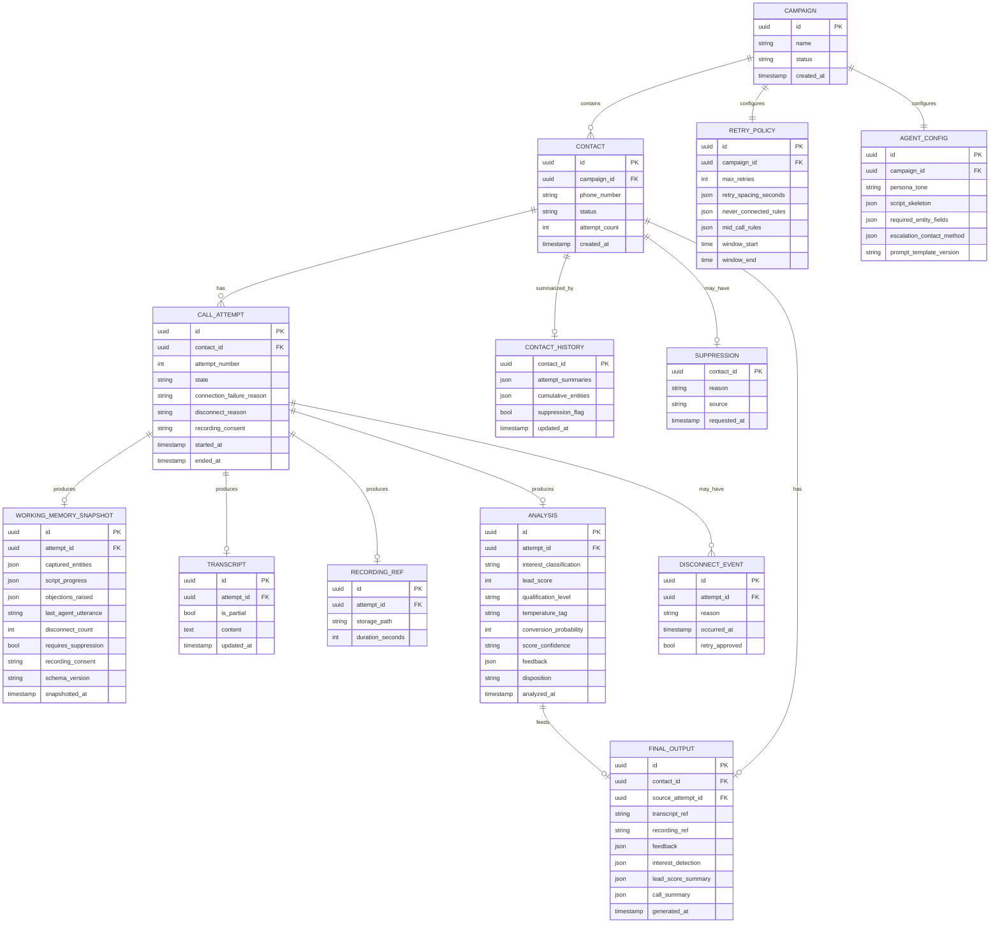

# AI Calling Agent — Database Design

Complete outbound calling workflow, with disconnect recovery · v1.0 · Status: Production Ready

**Related documents:** FRS v1.0 · System Architecture v1.0 · Infrastructure Architecture v1.0 · Call State Machine v1.0 · Memory Specification v1.0 · Lead Scoring Specification v1.0

**Purpose:** define the concrete schema — tables, fields, types, relationships, and indexes — that implements the entities described across the FRS, Call State Machine, Memory Specification, and Lead Scoring Specification. Maps to the "Primary DB," "Object Storage," and "Analytics Store" of the Infrastructure Architecture document.

---

## 1. Entity-relationship overview

---

## 2. Table definitions

### 2.1 `campaign`
| Column | Type | Constraints |
|---|---|---|
| `id` | uuid | PK |
| `name` | text | not null |
| `status` | enum | `draft`, `active`, `paused`, `completed` |
| `created_at` | timestamp | not null |

### 2.2 `retry_policy`
One row per campaign; the single shared configuration read by both never-connected and mid-call-disconnect retry evaluations (FRS FR-6.1–FR-6.7). Two independent, non-overlapping reason taxonomies are used — see Call State Machine §5.1–§5.2. `technical_issue` is valid only in `mid_call_rules`; it must never appear in `never_connected_rules`.

| Column | Type | Constraints |
|---|---|---|
| `id` | uuid | PK |
| `campaign_id` | uuid | FK → campaign.id, unique |
| `max_retries` | int | default 2 (retries beyond the initial attempt; 3 total dial attempts at default) |
| `retry_spacing_seconds` | json array | default `[30, 600]` — one value per retry (`max_retries` values); Retry #1 at 30s, Retry #2 at 600s (10 min) |
| `never_connected_rules` | json object | keys = `NEVER_CONNECTED_FAILURE_REASON` values; default `{"no_answer": true, "busy": true, "invalid_number": false, "rejected": false, "network_error": true, "provider_error": true}` |
| `mid_call_rules` | json object | keys = `MID_CALL_DISCONNECT_REASON` values; default `{"technical_issue": true, "network_problem": true, "provider_error": true, "ai_error": true, "unknown": true, "customer_hangup": false}` |
| `window_start` | time | default `10:00` |
| `window_end` | time | default `18:00` |

**Constraint:** `retry_spacing_seconds` array length must equal `max_retries` — every configured retry must have a spacing value, and no spacing value goes unused.

### 2.3 `agent_config`
One row per campaign; the agent's own configuration (AI Agent Specification §10), separate from retry policy.

| Column | Type | Constraints |
|---|---|---|
| `id` | uuid | PK |
| `campaign_id` | uuid | FK → campaign.id, unique |
| `persona_tone` | text | |
| `script_skeleton` | json | ordered talking points |
| `required_entity_fields` | json array | |
| `escalation_contact_method` | text | |
| `prompt_template_version` | text | Prompt Specification §8 |

### 2.4 `contact`
| Column | Type | Constraints |
|---|---|---|
| `id` | uuid | PK |
| `campaign_id` | uuid | FK → campaign.id |
| `phone_number` | text | not null, validated on insert |
| `status` | enum | `Pending`, `Dialing`, `InConversation`, `Disconnected`, `RetryScheduled`, `Reconnecting`, `Completed`, `CompletedPartial`, `Closed` — matches Call State Machine §2 |
| `attempt_count` | int | default 0 |
| `created_at` | timestamp | |

**Indexes:** `(campaign_id, status)` — supports queue dispatch queries and dashboard status counts. `(phone_number, campaign_id)` — supports dedupe on import (FR-1.3).

### 2.5 `call_attempt`
| Column | Type | Constraints |
|---|---|---|
| `id` | uuid | PK |
| `contact_id` | uuid | FK → contact.id |
| `attempt_number` | int | not null |
| `state` | enum | `Initiated`, `Connected`, `FailedToConnect`, `DroppedMidCall`, `EndedNormally` — Call State Machine §3 |
| `connection_failure_reason` | enum, nullable | `no_answer`, `busy`, `invalid_number`, `rejected`, `network_error`, `provider_error` |
| `disconnect_reason` | enum, nullable | `technical_issue`, `network_problem`, `provider_error`, `customer_hangup`, `ai_error`, `unknown` |
| `recording_consent` | enum, nullable | `granted`, `denied`, `unclear`, `not_applicable` — persisted from the structured-output top-level field (Prompt Specification §4) via working memory (Memory Specification §2) at Finalized |
| `started_at` | timestamp | |
| `ended_at` | timestamp, nullable | |

**Index:** `(contact_id, attempt_number)` — ordered attempt history for the contact view.

### 2.6 `working_memory_snapshot`
Written by the State Saver on disconnect (Memory Specification §3, "Snapshotted"). Retained only through the archival window (Memory Specification §9), not indefinitely.

| Column | Type | Constraints |
|---|---|---|
| `id` | uuid | PK |
| `attempt_id` | uuid | FK → call_attempt.id |
| `captured_entities` | json | |
| `script_progress` | json | `{phase, completed_points, pending_points}` |
| `objections_raised` | json array | |
| `last_agent_utterance` | text | |
| `disconnect_count` | int | |
| `requires_suppression` | bool | default false |
| `recording_consent` | enum, nullable | `granted`, `denied`, `unclear`, `not_applicable` — mirrors Memory Specification §2 |
| `schema_version` | text | Memory Specification §8 |
| `snapshotted_at` | timestamp | |

**Write invariant:** this row must be committed and acknowledged before the corresponding `disconnect_event.retry_approved` decision is written (Infrastructure Architecture §4).

### 2.7 `disconnect_event`
| Column | Type | Constraints |
|---|---|---|
| `id` | uuid | PK |
| `attempt_id` | uuid | FK → call_attempt.id |
| `reason` | enum | same set as `call_attempt.disconnect_reason` |
| `occurred_at` | timestamp | |
| `retry_approved` | bool, nullable | null until evaluated |

### 2.8 `transcript`
| Column | Type | Constraints |
|---|---|---|
| `id` | uuid | PK |
| `attempt_id` | uuid | FK → call_attempt.id, unique |
| `is_partial` | bool | true if the attempt ended via disconnect without full completion |
| `content` | text | timestamped turn log |
| `updated_at` | timestamp | |

### 2.9 `recording_ref`
Metadata only — the audio itself lives in Object Storage (Infrastructure Architecture §4).

| Column | Type | Constraints |
|---|---|---|
| `id` | uuid | PK |
| `attempt_id` | uuid | FK → call_attempt.id, unique |
| `storage_path` | text | object storage key |
| `duration_seconds` | int | |

### 2.10 `analysis`
Output of Post-Call Analysis (FRS FR-3.1, FR-3.2; Lead Scoring Specification).

| Column | Type | Constraints |
|---|---|---|
| `id` | uuid | PK |
| `attempt_id` | uuid | FK → call_attempt.id, unique |
| `interest_classification` | enum | `interested`, `not_interested`, `undecided` |
| `lead_score` | int | 0–100 |
| `qualification_level` | enum | `Unqualified`, `Marginal`, `Qualified`, `Highly Qualified` |
| `temperature_tag` | enum | `Hot`, `Warm`, `Cold` |
| `conversion_probability` | int | 0–100 |
| `score_confidence` | enum | `full`, `partial` — Lead Scoring Specification §5 |
| `feedback` | json | key points, sentiment, objections, suggestions |
| `disposition` | text | e.g. "Customer Hung Up", "Goal Met" |
| `analyzed_at` | timestamp | |

### 2.11 `contact_history`
One row per contact; the cross-attempt summary (Memory Specification §7).

| Column | Type | Constraints |
|---|---|---|
| `contact_id` | uuid | PK, FK → contact.id |
| `attempt_summaries` | json array | one entry per attempt |
| `cumulative_entities` | json | best-known values across attempts |
| `suppression_flag` | bool | default false; permanent once true |
| `updated_at` | timestamp | |

### 2.12 `suppression`
Separate, durable table so suppression survives independently of normal retention rules (Memory Specification §9). This is the **single canonical DNC/opt-out table** for the system — there is no separate `consents` or `dnc_records` table; any document referring to DNC or opt-out data means this table (see Data-Privacy.md §9 for the scope decision behind this).

| Column | Type | Constraints |
|---|---|---|
| `contact_id` | uuid | PK, FK → contact.id |
| `reason` | text | |
| `source` | enum | `agent_in_call` (captured via `requires_suppression` during a call, AI Agent Specification §8) or `manual_api` (added directly via the admin dashboard/API, outside a call) |
| `requested_at` | timestamp | |

**Note:** suppression should be checked against `phone_number` as well as `contact_id`, so a contact re-imported into a future campaign under a new `contact_id` is still caught. Every write to this table is audit-logged (Security Architecture §9), satisfying the auditability requirement; queued-retry cancellation and the final pre-dial eligibility check both read this table directly (Security Architecture §8).

### 2.13 `final_output`
The consolidated record (FRS FR-5.1–FR-5.3). Lives in the Analytics Store (Infrastructure Architecture §4) as a denormalized read-model, sourced from the tables above.

| Column | Type | Constraints |
|---|---|---|
| `id` | uuid | PK |
| `contact_id` | uuid | FK → contact.id |
| `source_attempt_id` | uuid | FK → call_attempt.id — the terminal attempt this record was generated from |
| `transcript_ref` | uuid | FK → transcript.id |
| `recording_ref` | uuid | FK → recording_ref.id |
| `feedback` | json | copied from `analysis.feedback` |
| `interest_detection` | json | interest, follow-up detection, buying intent, intent confidence |
| `lead_score_summary` | json | score, qualification level, temperature tag, conversion probability |
| `call_summary` | json | AI summary, next-action suggestion, disposition, tags/notes |
| `generated_at` | timestamp | |

**Generation rule:** exactly one `final_output` row per contact per terminal call, created from either a normal-completion `analysis` row or a `CompletedPartial` `analysis` row (Lead Scoring Specification §5) — never both, and never from a non-terminal attempt.

---

## 3. Cross-cutting constraints

- **State consistency:** `contact.status` and `call_attempt.state` must together always represent a valid combination per the Call State Machine — e.g. a contact cannot be `Completed` while its most recent `call_attempt.state` is `DroppedMidCall` with no corresponding `analysis` row.
- **Retry independence:** never-connected retries (via `contact.status = RetryScheduled` originating from `FailedToConnect`) and mid-call-disconnect retries (via `disconnect_event`) are tracked through different paths and must not be conflated in reporting queries.
- **One active working-memory snapshot per attempt:** `working_memory_snapshot` should retain the latest snapshot per `attempt_id`; a reconnect that disconnects again produces a new snapshot for the same attempt, not a new attempt record, since it's still the same underlying call attempt being retried in place until it reaches a terminal state or exhausts retries.

---

## 4. Storage placement summary

| Table | Store (Infrastructure Architecture §4) |
|---|---|
| `campaign`, `retry_policy`, `agent_config`, `contact`, `call_attempt`, `disconnect_event`, `transcript`, `recording_ref`, `analysis`, `contact_history`, `suppression` | Primary DB |
| Recording audio files | Object Storage (referenced by `recording_ref.storage_path`) |
| `working_memory_snapshot` | In-memory Store (durable-backed) for active/recent attempts |
| `final_output` | Analytics Store (denormalized, async-updated) |

---

*No lost conversations. More opportunities. Higher conversion.*
