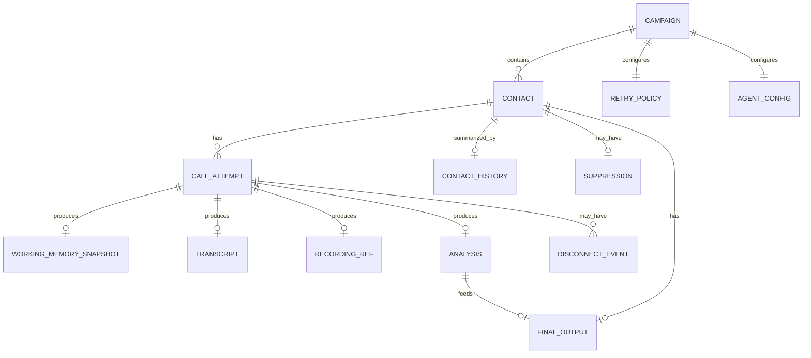
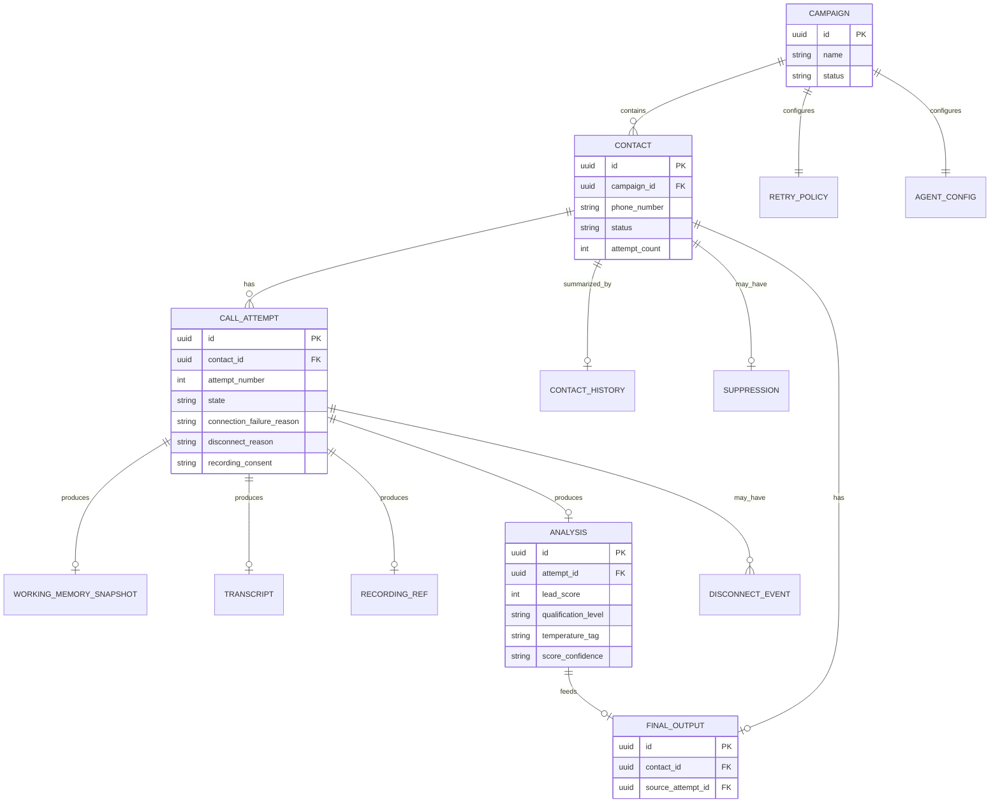

# AI Calling Agent — ER Diagram

Complete outbound calling workflow, with disconnect recovery · v1.0 · Status: Production Ready

**Related documents:** Database Design v1.0 · Memory Specification v1.0 · Call State Machine v1.0 · Lead Scoring Specification v1.0

**Purpose:** Database Design specifies every table's columns; this document is the relationship-first view — a high-level diagram for explaining the data model at a glance, and a full diagram for engineering reference, plus explicit reasoning for why each relationship has the cardinality it does.

---

## 1. High-level view (entities only)

For presentations and onboarding — no attributes, just what relates to what.

---

## 2. Full diagram (with key attributes)

Reproduced from Database Design §1 for reference in one place; see that document for the complete column-level definitions.

---

## 3. Cardinality reasoning

Explaining *why* each relationship is shaped the way it is — not just what the symbols say.

| Relationship | Cardinality | Why |
|---|---|---|
| Campaign → Contact | 1 : many | A campaign imports a batch of contacts; a contact belongs to exactly one campaign (re-importing the same phone number into a different campaign creates a distinct contact row). |
| Campaign → Retry Policy | 1 : 1 | One shared policy per campaign, evaluated independently for never-connected and mid-call-disconnect retries — never per-contact, so it doesn't vary within a campaign. |
| Campaign → Agent Config | 1 : 1 | Persona, script skeleton, and required fields are set once per campaign, not per contact or per call. |
| Contact → Call Attempt | 1 : many | A contact may be dialed multiple times (never-connected retries, or reconnects after a disconnect); each dial is its own attempt row. |
| Contact → Contact History | 1 : 0..1 | Created once the contact has at least one finalized attempt to summarize; absent for a contact still `Pending`. |
| Contact → Suppression | 1 : 0..1 | Only present if the contact explicitly requested removal — most contacts never have this row. |
| Call Attempt → Working Memory Snapshot | 1 : 0..1 | Only created if that attempt disconnected at least once; an attempt that completed without ever dropping has no snapshot. |
| Call Attempt → Transcript | 1 : 0..1 | Present once the attempt has produced any spoken exchange; a call that never connects has no transcript. |
| Call Attempt → Recording Ref | 1 : 0..1 | Same reasoning as Transcript — only for attempts that actually connected. |
| Call Attempt → Analysis | 1 : 0..1 | Only for attempts that reached a terminal state where post-call analysis runs (`EndedNormally` or closed as `CompletedPartial`) — not for `FailedToConnect`. |
| Call Attempt → Disconnect Event | 1 : many | An attempt can disconnect, reconnect, and disconnect again before reaching a terminal state; each disconnect is logged separately. |
| Analysis → Final Output | 1 : 0..1 | Not every analyzed attempt produces a Final Output directly — only the one terminal attempt selected as `source_attempt_id` for that contact does. |
| Contact → Final Output | 1 : 0..1 | Exactly one Final Output per contact, ever — this is the single-record guarantee from the Lead Scoring and FRS documents (`FR-5.1`). |

---

## 4. Reading the "optional" (`o|`) relationships

Most of the interesting cardinality in this schema is in the **optional** side — a `0..1` or `0..many` almost always corresponds to a specific stage in the Call State Machine or Detailed Workflow where that row simply hasn't been created yet, or never will be for that particular path:

- No `Working Memory Snapshot` → the attempt never disconnected.
- No `Analysis` → the attempt never reached a terminal, analyzable state (still in progress, or never connected).
- No `Final Output` → the contact hasn't yet completed a call, or (rarer) is in a state where analysis exists but hasn't been promoted to a Final Output record.
- No `Suppression` → the default, unflagged case.

None of these are error states — they're expected absences that simply reflect where a given contact or attempt currently sits in its lifecycle.

---

*No lost conversations. More opportunities. Higher conversion.*
