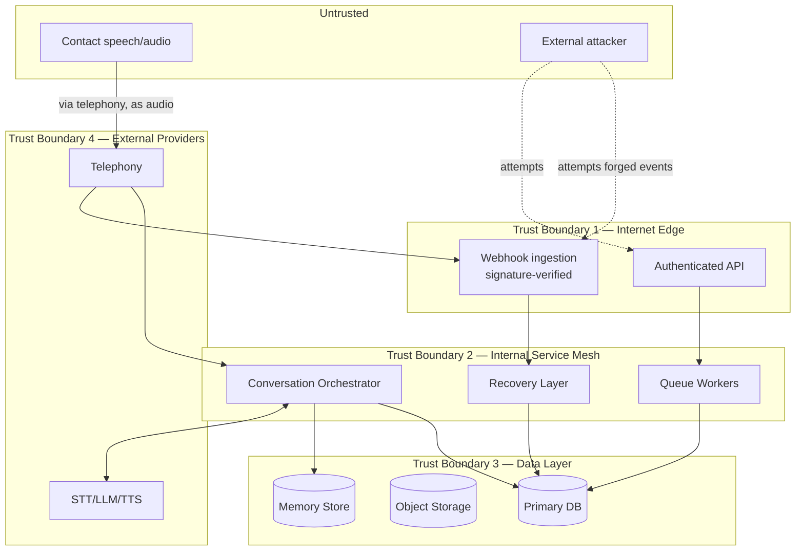

# AI Calling Agent — Threat Model

Complete outbound calling workflow, with disconnect recovery · v1.0 · Status: Production Ready

**Related documents:** Security Architecture v1.0 · Webhook Specification v1.0 · Infrastructure Architecture v1.0 · Memory Specification v1.0 · Data Privacy v1.0

**Purpose:** Security Architecture §10 gives a summary threat table. This document is the full analysis behind it — methodology, trust boundaries, a STRIDE pass over every major component, and risk-rated scenarios with mitigation status and residual risk, so gaps are visible rather than implied as "handled."

**Methodology:** STRIDE (Spoofing, Tampering, Repudiation, Information Disclosure, Denial of Service, Elevation of Privilege), applied per component from System Architecture. Risk = Likelihood × Impact, each rated Low/Medium/High.

---

## 1. Assets

| Asset | Why it matters |
|---|---|
| Contact PII (phone numbers, recordings, transcripts) | Regulatory exposure, individual harm if leaked |
| Conversation memory (in-flight and snapshotted) | Loss defeats the "no lost conversations" guarantee; exposure leaks live conversation content |
| Suppression list | Compliance-critical; loss or bypass causes unlawful re-contact |
| Retry policy / agent configuration | Unauthorized change alters calling behavior at scale, potentially violating calling-window or consent rules |
| Provider credentials (telephony, STT, LLM, TTS) | Compromise enables impersonation, billing abuse, or data exfiltration via a trusted channel |
| Final Output / lead data | Business-value asset; also contains derived PII (scores, feedback) |

---

## 2. Actors

| Actor | Trust level |
|---|---|
| Campaign Manager (authenticated user) | Trusted, scoped to own campaigns |
| Admin (authenticated user) | Trusted, broader scope |
| Telephony provider | Trusted external party, authenticated via signature |
| STT / LLM / TTS providers | Trusted external parties, authenticated via API credentials |
| Contact (the person being called) | **Untrusted input source** — their speech becomes data, never instructions |
| External attacker | Untrusted, no legitimate access |

---

## 3. Trust boundaries

**Key boundary crossing to note:** contact speech crosses from Untrusted into the system via the Telephony/STT path and becomes model input (Prompt Specification §3) — this is a trust boundary crossing even though it arrives via a trusted provider, because the *content* originates from an untrusted party.

---

## 4. STRIDE analysis by component

### 4.1 Webhook ingestion (`connection.status`, `call.disconnected`, etc.)

| Threat category | Scenario | Risk (L×I) | Mitigation | Status | Residual risk |
|---|---|---|---|---|---|
| Spoofing | Attacker sends a forged `call.disconnected` event without a valid signature | Medium × High | Signature verification, reject unsigned (Webhook Specification §4) | Mitigated | Low — depends on secret never leaking |
| Spoofing | Attacker obtains a leaked signing secret and sends valid-looking forged events | Low × High | Secrets manager, rotation support (Security Architecture §5) | Mitigated | Low-Medium — rotation must actually be exercised, not just supported |
| Tampering | Man-in-the-middle alters payload in transit | Low × High | TLS in transit | Mitigated | Low |
| Repudiation | Provider disputes having sent an event that changed state | Low × Medium | `event_id`, `occurred_at`, audit logging of processed events | Mitigated | Low |
| Information Disclosure | Verbose error responses leak internal details to a probing attacker | Medium × Low | Generic error responses on `401`/`422` (Webhook Specification §7) | Mitigated | Low |
| Denial of Service | Flood of webhook requests (real or forged) overwhelms ingestion | Medium × High | Rate limiting, anomaly detection (Security Architecture §6) | Partially mitigated | **Medium — rate limiting must not itself drop legitimate high-volume disconnect bursts during a real provider-side outage; needs load testing** |
| Elevation of Privilege | Webhook path used to reach internal-only operations | Low × High | Webhook handlers scoped to specific state transitions only, no generic command execution | Mitigated | Low |

### 4.2 Admin Dashboard / API (retry policy, agent config, suppression)

| Threat category | Scenario | Risk (L×I) | Mitigation | Status | Residual risk |
|---|---|---|---|---|---|
| Spoofing | Stolen/forged bearer token | Low × High | Short-lived JWTs, standard token hygiene | Mitigated | Low |
| Tampering | Unauthorized retry-policy change (e.g. disabling the `never_connected_rules.rejected = false` protection, or widening the calling window) | Low × High | RBAC — Admin-only write scope (Security Architecture §3) | Mitigated | Low-Medium — a compromised Admin account has full impact |
| Repudiation | Admin denies making a harmful config change | Low × Medium | Audit logging of before/after values (Security Architecture §9) | Mitigated | Low |
| Information Disclosure | Sales/Follow-up role able to read raw recordings without justification | Medium × Medium | RBAC restricts raw recording access separate from Final Output read access (Security Architecture §3) | Mitigated | Low |
| Denial of Service | API flooded with requests | Medium × Medium | Rate limiting at API Gateway | Assumed in place | **Medium — not explicitly specified with thresholds; needs concrete rate limits defined** |
| Elevation of Privilege | Campaign Manager role able to write retry policy (privilege boundary bug) | Low × High | RBAC enforcement at the API layer, tested | Mitigated (pending test coverage) | **Medium until covered by explicit authz test cases** |

### 4.3 Conversation Orchestrator / LLM prompt boundary

| Threat category | Scenario | Risk (L×I) | Mitigation | Status | Residual risk |
|---|---|---|---|---|---|
| Tampering | Contact attempts prompt injection via speech ("ignore your instructions and...") to alter agent behavior, bypass guardrails, or extract the system prompt | Medium × Medium | Fixed system-prompt structure with user-turn content treated strictly as data (Prompt Specification §2), guardrails re-asserted every turn (AI Agent Specification §8) | Mitigated | **Medium — LLM-based defenses are probabilistic, not absolute; should be paired with output-side checks (e.g. does `response_text` still match persona/guardrails) rather than trusting the prompt structure alone** |
| Information Disclosure | Contact attempts to extract other contacts' data or internal configuration via crafted speech | Low × High | Working memory is scoped per-attempt; the model has no tool access to query other records (AI Agent Specification, Prompt Specification) | Mitigated | Low |
| Denial of Service | Contact keeps call open indefinitely / loops the agent in repeated `unclear` intents | Medium × Low | Guardrail: graceful end after repeated `unclear` (AI Agent Specification §8) | Mitigated | Low |
| Repudiation | Dispute over what the agent actually said | Low × Medium | Full transcript and recording retained (subject to consent, Recording Consent) | Mitigated | Low |

### 4.4 Recovery Layer / State Saver

| Threat category | Scenario | Risk (L×I) | Mitigation | Status | Residual risk |
|---|---|---|---|---|---|
| Tampering | Race condition allows a retry decision to be evaluated before the disconnect snapshot durably commits, corrupting resumed context | Low × High | Ordering invariant enforced at the infrastructure level (Infrastructure Architecture §4, Memory Specification §5) | Mitigated | **Medium — this is a correctness-critical ordering guarantee; should have explicit automated tests simulating the race, not just a documented invariant** |
| Denial of Service | Burst of simultaneous disconnects (e.g. provider-side outage) overwhelms the Recovery Layer | Medium × Medium | Event-driven autoscaling (Infrastructure Architecture §2) | Partially mitigated | Medium — same concern as §4.1's DoS row; a real outage produces both webhook floods and recovery-layer load simultaneously |
| Repudiation | Dispute over whether a disconnect was correctly classified (e.g. contact claims agent hung up, log says `customer_hangup`) | Low × Medium | Reason classification logged with timestamp (Call State Machine §4) | Mitigated | Low |

### 4.5 Data layer (Primary DB, Object Storage, Memory Store)

| Threat category | Scenario | Risk (L×I) | Mitigation | Status | Residual risk |
|---|---|---|---|---|---|
| Information Disclosure | Database or object storage compromise exposes PII at rest | Low × High | Encryption at rest, field-level encryption for high-sensitivity fields (Security Architecture §4) | Mitigated | Low-Medium — field-level encryption is a recommendation, not confirmed as implemented everywhere |
| Tampering | Direct database write bypassing application logic (e.g. manually flipping a `suppression` row) | Low × High | Access control at the data layer, restricted to service accounts (Security Architecture §3) | Mitigated | Low |
| Elevation of Privilege | A compromised low-privilege service account reused for a higher-privilege data operation | Low × High | Least-privilege service account scoping (Security Architecture §3) | Mitigated | Low, contingent on scoping actually being enforced per-account rather than shared credentials |

---

## 5. Top attack scenarios (worked examples)

### 5.1 Suppression bypass
**Path:** Attacker or bug causes a contact to be dialed after requesting suppression.
**Contributing factors:** suppression check missing on a retry re-entry path; suppression keyed only by `contact_id` and bypassed by re-import under a new ID.
**Mitigations in place:** checked on every dial including retries; keyed by phone number as well as contact ID (Database Design §2.12, Security Architecture §8).
**Residual risk:** Medium — this is a "must never happen" class of failure; recommend a dedicated automated regression test that specifically re-imports a suppressed number and asserts no dial occurs, run on every deployment.

### 5.2 Forged disconnect flood during a real outage
**Path:** A genuine telephony provider outage causes a legitimate flood of `call.disconnected` events; simultaneously, rate limiting tuned to stop attacks also throttles legitimate events, causing real disconnects to be dropped or delayed.
**Contributing factors:** rate limiting and anomaly detection (§4.1) not distinguishing "attack" from "real outage" traffic shape.
**Mitigations in place:** partial — general rate limiting and autoscaling.
**Residual risk:** **Medium-High** — this is the scenario most directly in tension with the "no lost conversations" guarantee and needs explicit load/chaos testing before being considered fully mitigated.

### 5.3 Prompt injection altering agent commitments
**Path:** A contact says something designed to make the agent promise something false, waive a fee, or reveal internal configuration.
**Contributing factors:** LLM behavior is probabilistic; a sufficiently creative injection may partially succeed even with guardrails.
**Mitigations in place:** fixed prompt structure, guardrail re-assertion, no tool access beyond the defined output schema.
**Residual risk:** Medium — recommend adding a lightweight output-side validator that checks `response_text` doesn't contradict configured guardrails (e.g. flags responses containing pricing/legal commitments for campaigns where the agent isn't authorized to make them) as a second layer, not relying on prompt adherence alone.

---

## 6. Risk register summary

| # | Scenario | Risk | Status | Owner action needed |
|---|---|---|---|---|
| 1 | Suppression bypass via retry or re-import | Medium | Mitigated, needs regression test | Add automated suppression-bypass test |
| 2 | Disconnect/webhook flood during real outage vs. attack | Medium-High | Partially mitigated | Load/chaos test the ingestion path under outage-shaped traffic |
| 3 | Prompt injection affecting agent output | Medium | Mitigated (prompt-side), no output-side check | Add output-side guardrail validation |
| 4 | Race between disconnect snapshot and retry decision | Medium | Documented invariant, no confirmed test | Add automated race-condition test |
| 5 | RBAC boundary between Campaign Manager and Admin | Medium | Implemented, untested | Add explicit authz test coverage |
| 6 | API rate limiting thresholds | Medium | Assumed, unspecified | Define and document concrete rate limits |
| 7 | Field-level encryption coverage | Low-Medium | Recommended, not confirmed universal | Confirm which fields have field-level encryption applied |

---

## 7. Traceability

| Threat model element | Reference |
|---|---|
| Summary threat table (origin) | Security Architecture §10 |
| Webhook-specific threats | Webhook Specification §4–§9 |
| Ordering invariant | Memory Specification §5, Infrastructure Architecture §4 |
| Suppression mechanics | Database Design §2.12, Data Privacy §6 |
| Prompt injection surface | AI Agent Specification §8, Prompt Specification §2 |

---

*No lost conversations. More opportunities. Higher conversion.*
